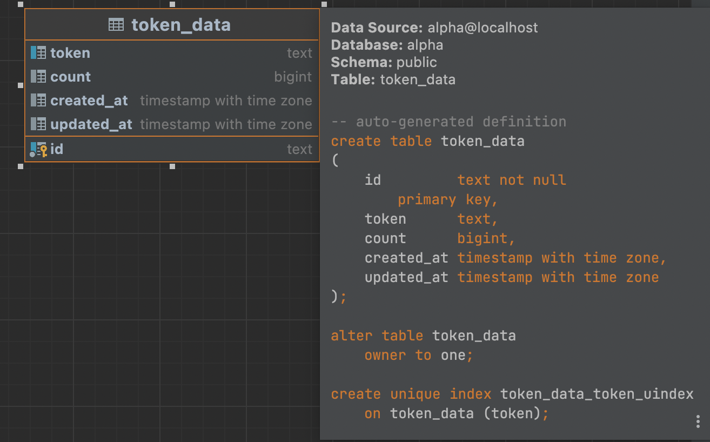

# Token Generation and Persistence

### Requirements
- go1.18.1 +
- postgres

### Setup
- Create postgres user if not created already
  ```shell
  make create-pg-user
  ```
- Create campaign service db if not created already
  ```shell
  make create-db
  ```
- Start application
    ```shell
    make run
    ```
### Documentation
The operations are divided into 3 services, ie `TokenGeneration` `TokenLoader` and `TokenFetch`
 - TokenGeneration is responsible for generating random token of size 7 for 10^6 times and write into a file
 - TokenLoader is responsible for Loading tokens from file and inserting them into database, before insertion it uses a hash map ti count frequencies and then batch inserts into DB
 - TokenFetch simply fetches token from DB and writes into a file

### DB schema




